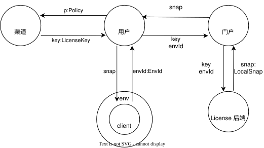

# license-sdk

用于本地软件离线授权校验的 Rust SDK。客户端通过 SDK 从**本地许可环境**（由激活入口 [license-active](http://192.168.1.252:3000/cbitc/license-active) 写入的共享数据库）读取离线令牌，在离线的情况下完成签名验证、有效期校验、设备指纹比对，判断当前环境是否已获得许可。

## 安装

在应用的 `Cargo.toml` 中添加：

```toml
[dependencies]
license-sdk = { git = "http://192.168.1.252:3000/cbitc/license-sdk-rust.git", tag = "v0.2.0" }
```

## 快速开始

```rust
use license_sdk::LicenseError;

fn main() -> Result<(), Box<dyn std::error::Error>> {
    match license_sdk::verify_environment() {
        Ok(license) => {
            println!("环境已激活");
            println!("许可证密钥: {}", license.claims.license_key);
            println!(
                "授权功能: {:?}",
                license
                    .claims
                    .entitlements
                    .iter()
                    .map(|item| item.code.as_str())
                    .collect::<Vec<_>>()
            );
            println!("令牌有效期至: {}", license.claims.exp);
        }
        Err(LicenseError::Inactive) => {
            println!("当前环境未激活，请先运行激活程序完成激活");
        }
        Err(LicenseError::FingerprintMismatch) => {
            println!("令牌不属于当前设备");
        }
        Err(LicenseError::Expired) => {
            println!("离线令牌已过期，请重新激活");
        }
        Err(error) => {
            println!("环境校验失败: {error}");
        }
    }

    Ok(())
}

```

完整可运行示例见 `examples/mdt_agent_client.rs`（`cargo run --example mdt_agent_client`）。

## 本地许可环境契约

| 项 | 值 |
| --- | --- |
| 数据库路径 | Windows 为 `%LOCALAPPDATA%\license-tools\license-active\data\license.db`） |
| 写入方 | license-active 激活入口（bind 成功后写入令牌） |
| 读取方 | 任意集成本 SDK 的客户端|
| 激活记录 | 单行 JSON：`{ token, source: "online"/"offline", activated_at }` |

SDK **全程只读**：读取用只读连接，不会创建目录或库文件；客户端可将 `Err` 一律视为未许可处理。


